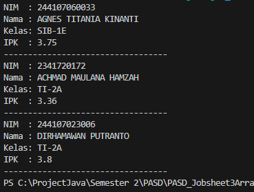
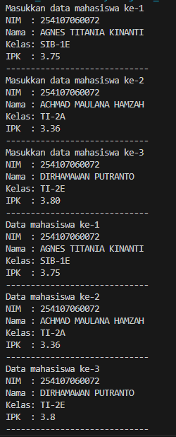
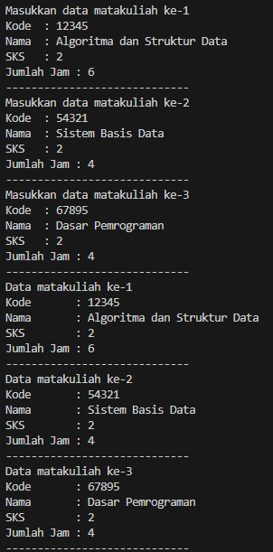
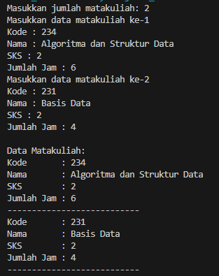
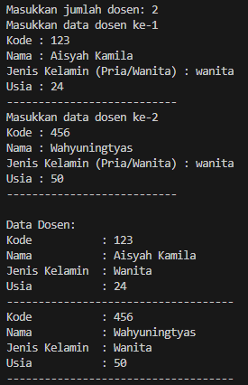
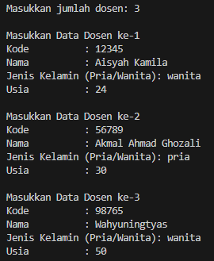
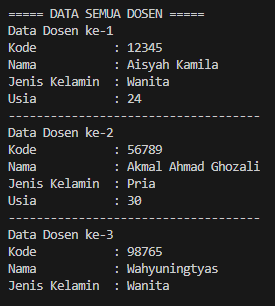
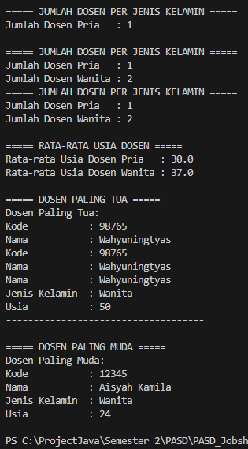

# PASD Jobsheet 3 Array Of Object

## 3.2 Membuat Array dari Object, Mengisi dan Menampilkan

## 3.2.2 Verifikasi Hasil Percobaan


## 3.2.3 Pertanyaan
## 1. Berdasarkan uji coba 3.2, apakah class yang akan dibuat array of object harus selalu memiliki atribut dan sekaligus method? Jelaskan!

Sebuah class tidak wajib memiliki method untuk bisa dibuat menjadi array of object. Minimal, class tersebut harus bisa diinstansiasi (dibuat objeknya). Pada praktikum ini, class Mahasiswa21 hanya memiliki atribut (nim, nama, kelas, ipk) tanpa method, tetapi tetap bisa dibuat array of object.

----
## 2. Apa yang dilakukan oleh kode berikut?
```java
Mahasiswa21[] arrayOfMahasiswa = new Mahasiswa21[3];
```
Kode tersebut membuat array yang dapat menyimpan 3 objek Mahasiswa21, tetapi belum membuat objeknya, setiap elemen array masih bernilai null

---
## 3. Apakah class Mahasiswa memiliki konstruktor? Jika tidak, kenapa bisa dilakukan pemanggilan konstruktur pada baris program berikut?
 ```java
arrayOfMahasiswa[0] = new Mahasiswa21();
 ```
Di dalam class Mahasiswa21 memang tidak dituliskan konstruktor secara eksplisit. Namun, Java secara otomatis memberikan default constructor jika kita tidak membuat konstruktor sendiri, karena itu pemanggilan tersebut tetap bisa dilakukan

## 4. Apa yang dilakukan oleh kode program berikut?
```java
arrayOfMahasiswa[0] = new Mahasiswa21();
arrayOfMahasiswa[0].nim = "244107060033";
arrayOfMahasiswa[0].nama = "AGNES TITANIA KINANTI";
arrayOfMahasiswa[0].kelas = "SIB-1E";
arrayOfMahasiswa[0].ipk = (float)3.75;
```
kode tersebut membuat objek dan mengisi data ke dalam objek

## 5. Mengapa class Mahasiswa21 dan MahasiswaDemo21 dipisahkan?
Karena mengikuti prinsip separation of responsibility.
Mahasiswa21 → berisi blueprint / model data mahasiswa(atribut)
MahasiswaDemo21 → berisi program utama (main method) untuk menjalankan dan menguji class Mahasiswa21. keuntungannya kode lebih rapi, mudah dikembangkan, bisa digunakan kembali.

## 3.3 Menerima Input Isian Array Menggunakan Looping

## 3.3.2 Verifikasi Hasil Percobaan


## 3.3.3 Pertanyaan

## 2. Misalkan Anda punya array baru bertipe array of Mahasiswa dengan nama myArrayOfMahasiswa. Mengapa kode berikut menyebabkan error?
```java
Mahasiswa[] myArrayOfMahasiswa = new Mahasiswa[3];
myArrayOfMahasiswa[0].nim = "244107060033";
myArrayOfMahasiswa[0].nama = "AGNES TITANIA KINANTI";
myArrayOfMahasiswa[0].kelas = "SIB-1E";
myArrayOfMahasiswa[0].ipk = (float) 3.75;
```
karena objek Mahasiswa belum dibuat, yang dibuat hanya array saya tetapi isi objeknya masih null. program mencoba mengakses objek yang masih null sehingga muncul error.

## 3.4 Constructor Berparameter

## 3.4.2 Verifikasi Hasil Percobaan


## 3.4.3 Pertanyaan
## 1. Apakah suatu class dapat memiliki lebih dari 1 constructor? Jika iya, berikan contohnya

Bisa, Hal ini disebut Constructor Overloading, yaitu satu class memiliki beberapa constructor dengan parameter berbeda. Contoh: 
```java
public class Matakuliah21 {
    public String kode;
    public String nama;
    public int sks;
    public int jumlahJam;

    // Constructor tanpa parameter
    public Matakuliah21() {

    }

    // Constructor dengan parameter
    public Matakuliah21(String kode, String nama, int sks, int jumlahJam) {
        this.kode = kode;
        this.nama = nama;
        this.sks = sks;
        this.jumlahJam = jumlahJam;
    }
}
```
objek bisa dibuat dengan dua cara
```java
Matakuliah21 mk1 = new Matakuliah21();

Matakuliah21 mk2 = new Matakuliah21("MK01","Algoritma",3,6);
```
## Hasil modifikasi pertanyaan nomer 2 - 4



## 3.5 Tugas 
## Output nomer 1


## Output nomer 2


